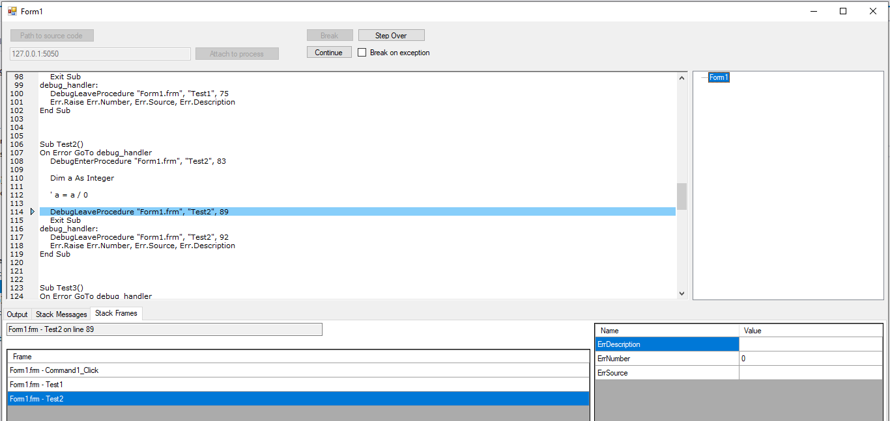

# VBDebugger

Features:
 - Break
 - Resume
 - Step over code
 - Break on exception



## Compilling
If the Scintilla control throws errors, copy `Scintilla.dll` and `Lexilla.dll` from `VBDebugger\packages\Scintilla.NET.5.3.2.7\build\x86` to `%localappdata%\Microsoft\VisualStudio\16.0_6ae64920\build\x86`.

Compile the solution. 
Finally this will generate:
 - the debugger/editor program **VBDebugger.exe**
 - the native debugging runtime **VBRuntime.dll** (which will be referenced as a library inside VB6 code)
 - the auto code transformer **VBCodeTransformer.exe** (used for auto templating)

## Setting debugging runtime for VB6
The native runtime generated at the previous step must be interfaced with VB6.
Edit the `Debugger.bas` module file and set the path of the dll, if needed, to `VBRuntime.dll`.

For remote debugging to work properly the default template must be used for the debugged functions:
 - The functions must be surrounded in try catch exception handler (this does not affect behaviour because the error is rethrown so the calling function does not see a difference)
 - All functions must call DebugEnterProcedure as first instruction
 - They also must call DebugLeaveProcedure before every `Exit Sub`, `Exit Function`, `End Sub`, `End Function` and inside the function's recently installed error handler.
 - `DebugLog` should be called inside every error handler that already exists in the function as to capture the exceptions 

**Template:**
```
Private Sub Command1_Click()
On Error GoTo debug_handler
    DebugEnterProcedure "Form1.frm", "Command1_Click", __LINE__

    DebugLog "Form1.frm", "Command1_Click", __LINE__
    Test1 "test"
    
    DebugLeaveProcedure "Form1.frm", "Command1_Click", __LINE__
    Exit Sub
debug_handler:
    DebugLeaveProcedure "Form1.frm", "Command1_Click", __LINE__
    Err.Raise Err.Number, Err.Source, Err.Description
End Sub
```

## Auto Template Generator
The project also include an auto template creator `VBAutoTransformer` which may be unstable (work in progress) which uses ANTLR with a VB6 lexer and parser.
The tool automatically injects the exception guards and some `DebugLog` above procedure calls.

#### Running
  - Run the compiled executable, load `.frm` files containing VB6 code and process the file.
  - The results can manually be edited after processing for adding more checkpoints.


## Issues
 - Exceptions are treated like common variables.
 - Because VB6 uses one object for errors, there are many possible cases when the exception is jumped over but the object remains filled (`On Resume Next`). It's hard for the frontend to know when a new exception is raised:
   - it does so by comparing Number, Source and Description of previous exceptions with current one
   - thus it has a blind spot when the same exception is raised a second time with the same information 
